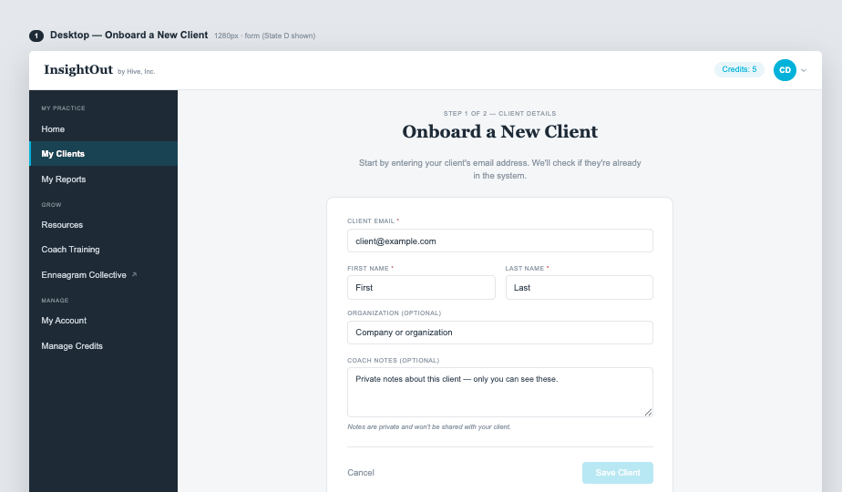
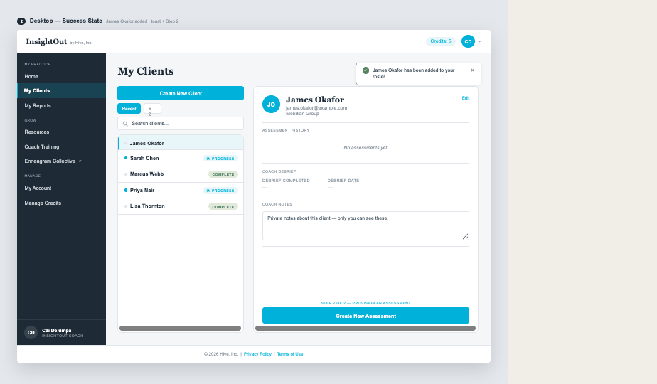
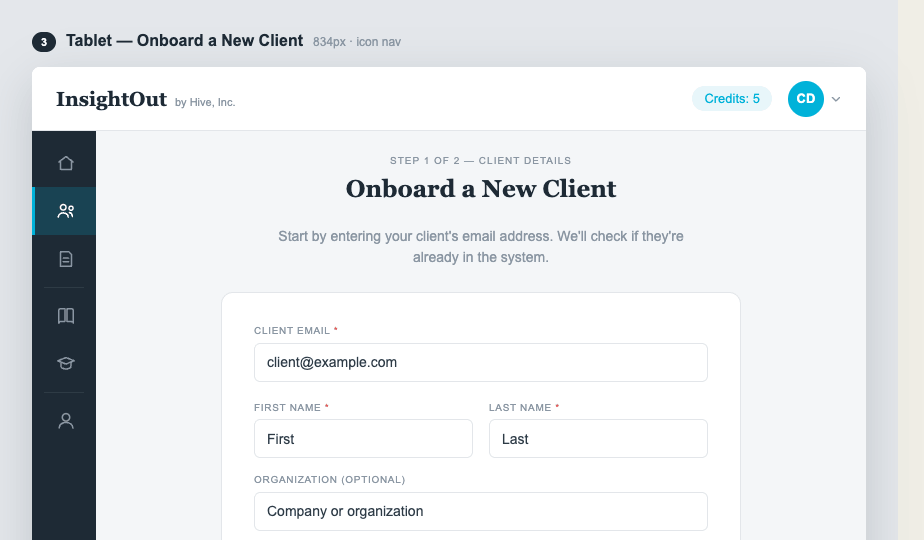
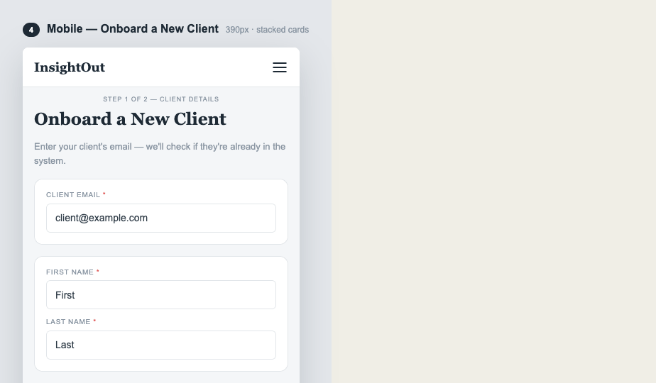
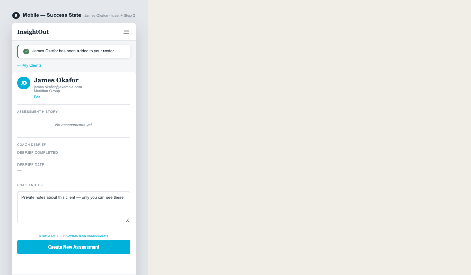

# InsightOut Coach Portal — Design Spec Addendum: §7.3 Onboard a New Client

**Version 1.0 · Confidential · Hive, Inc.**

**Status:** Locked. Resolves the same "unchanged from v1.4, full specs on record" gap
Design Spec v2.2 had for §7.3. Transcribed from the Claude Design mockup set (desktop
form + success, tablet, mobile form + success) plus three lookup states (Checking,
Found-Own-Roster, Found-Other-Coach's-Roster) designed and ratified by Cai to fill a
real gap — those states were never exported from the design session; only the default
form state ("State D") and the success state existed. Fold into the master Design Spec
as §7.3 whenever that document is next revised.

**Route:** `/coach/clients/new`. Already linked from three places per PR4a (Create New
Client button, empty-state CTA) and currently 404s cleanly — this PR fills that in.

**Job mapping:** J2 — "Get a client into the system."

**Flow:** two logical steps on one page. Step 1 (this screen) collects client details.
Step 2 is not a separate screen — after save, the coach lands on My Clients (already
built, PR4a) with the new client selected, and is prompted to provision an assessment
via the existing Create New Assessment modal.

## Step 1 — Client Details (default/base form)

Full-page form within the portal shell (not a modal). Eyebrow "STEP 1 OF 2 — CLIENT
DETAILS", H1 "Onboard a New Client" (Georgia bold, centered), subtitle "Start by
entering your client's email address. We'll check if they're already in the system."
(Arial, muted, centered).

White card, centered, containing:
- **Client Email*** — text input, placeholder `client@example.com`. Triggers the
  lookup on blur (tab away), not on every keystroke.
- **First Name*** / **Last Name*** — two-column row.
- **Organization (optional)** — text input, placeholder "Company or organization".
- **Coach Notes (optional)** — textarea, placeholder "Private notes about this client —
  only you can see these.", hint below: "Notes are private and won't be shared with
  your client."
- Divider, then "Cancel" (ghost link, left) + "Save Client" (primary button, right).

This same layout serves as the outcome of a lookup that finds no match — the coach
proceeds to fill in name/org manually for a genuinely new client.

## Lookup states (net-new, designed this session — see below)

Fired on email-field blur against a new `GET /coach/clients/lookup?email=` endpoint.

**No screenshot mockup exists for these three states — they were never designed in the
original Claude Design session.** A live reference implementation (real HTML/CSS, exact
hex values, open directly in a browser) is included at
`./OnboardClient_addendum_images/06-lookup-states-reference.html`. Treat it as
equally authoritative to the PNG mockups elsewhere in this doc — it's the actual
approved design, just delivered as markup instead of a raster export.

### State B — Checking

Spinner inside the email field (border color shifts to `--color-primary`), "Checking..."
microcopy below it, First/Last/Org fields visibly disabled (40% opacity) until the
lookup resolves. Brief — no artificial delay.

### State C1 — Found, already on your roster

Info banner above the form fields: `--color-primary-light` bg, `--color-primary-dark`
text — "**[Name]** is already in your roster. We've filled in their details — continue
to provision a new assessment." Email field becomes read-only. First/Last Name fields
pre-fill from the existing record and become read-only (grayed, per the original
requirement). Organization pre-fills the same way if present. The Save Client button is
replaced by **"Continue to Assessment →"** — this does NOT create a duplicate client
record. It navigates directly to My Clients with that existing client selected and
opens the Create New Assessment modal (already built, PR4a) — same terminal action as
a normal Step 2, just skipping the redundant re-save.

### State C2 — Found, belongs to another coach

Warning banner: `--color-accent-light` bg, a warning-toned text color — "This email is
already associated with another coach's client roster. If you believe this is an
error, contact Hive support." Email field border shifts to `--color-accent`. First/Last
Name fields stay disabled (40% opacity, unfillable). Save Client renders disabled/inert
(muted bg, muted text) — there is no path forward on this screen. This is a deliberate
product decision, not just UI: per the Provisioning & Commerce Architecture doc,
coach-to-client reassignment is admin-only for October. A coach must not be able to
self-claim another coach's existing client through this form.

## Success state

After Save Client (or after a State C1 "Continue to Assessment" — though that case
skips this and goes straight to the modal): toast notification — green checkmark,
"[Name] has been added to your roster.", dismissible ×. Desktop: floats top-right of
the workspace. Mobile: renders as an inline banner at the top of the page (accent-left
border, not floating).

Lands on My Clients (`/coach/clients`) with the new client auto-selected in the detail
panel: avatar/name/email/org, "Edit" link, Assessment History showing "No assessments
yet." (italic, muted — matches the existing empty-state convention), Coach Debrief
showing em-dashes for both fields (not yet applicable), Coach Notes pre-filled with
whatever was entered in Step 1. Below that: eyebrow "STEP 2 OF 2 — PROVISION AN
ASSESSMENT" + full-width **"Create New Assessment"** button, which opens the existing
modal from PR4a.

## Breakpoints

- **Desktop/Tablet:** single unified white card holding all fields, as shown above.
  Tablet uses the icon-only 64px nav (real icons — additional icon references
  confirmed here beyond what the My Clients mockup showed: home, people/clients, file/
  reports, book/resources, graduation-cap/training, person/account — useful input for
  PR4c whenever that's picked up).
- **Mobile:** fields split into **separate stacked cards** rather than one continuous
  card — Client Email is its own card, First/Last Name (and presumably Organization,
  Coach Notes) form a second card below it. This differs from desktop's single-card
  layout; do not collapse it into one card on mobile.

## Backend notes

- `GET /coach/clients/lookup?email=` — new endpoint. The original provisioning
  groundwork already flagged that `getClientByEmail` (db.js) "returns `{ id, coach_id }`
  only — the Onboard screen's 'already exists / belongs to another coach' states will
  need a richer projection" (name, organization). This PR is where that richer
  projection actually gets built and used.
- Ownership check on the lookup result: `coach_id === req.session.coach_id` → State C1;
  `coach_id !== req.session.coach_id` → State C2; no match → default form (proceed as
  new client).
- Save Client on a no-match path creates the client scoped to `req.session.coach_id` —
  same ownership discipline established in PR4a.

*End of Addendum — v1.0*
